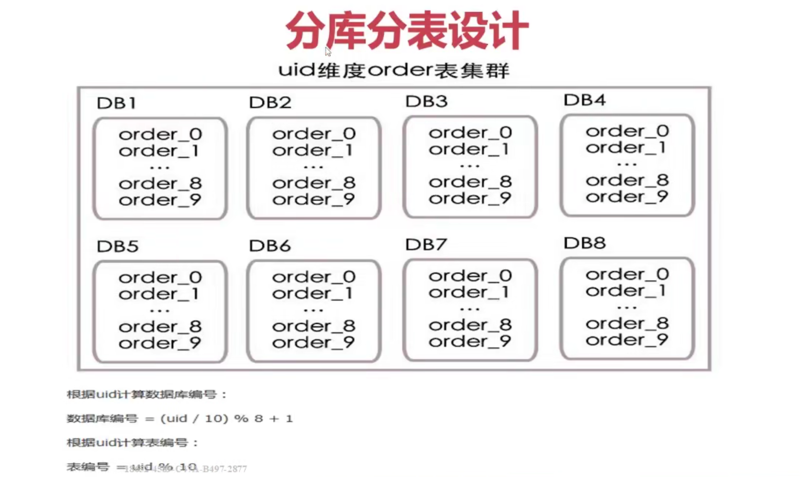
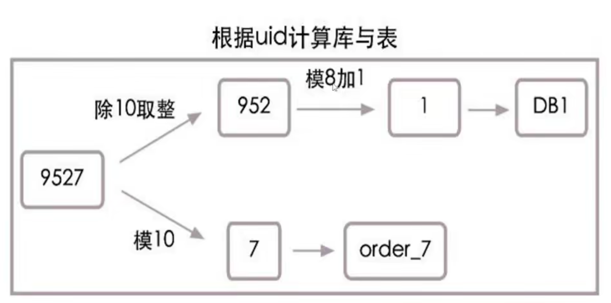

[TOC]

# 目录

## 分库分表设计

1. 单数据库实例
1. 读写分离
1. 垂直拆分
1. 水平拆分

## 分库分表原则

- 水平分表，根据特定的规则
- 路由表结构，业务维度，查询效率，业务需求点，瓶颈
- 数据源切换，多少个库表，切换策略，散表策略
- 事务问题，分布式事务，衡量指标，压测结果

## 图例

每个DB有10张表，分了8个库，一共800张表

- 根据uid计算数据库编号：
    - 数据库编号 = （uid / 10） % 8 + 1
- 根据uuid计算表编号
    - 表编号 = uid % 10
    
当uid=9527时，根据上面的**算法**，其实是把uid分成了两部分952和7，其中952模8加1等于1为数据库编号，而7则为表编号。所以uid=9527的订单信息需要去db1库中的order_7表查找。具体算法流程也可参见下图：

